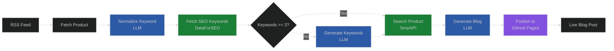
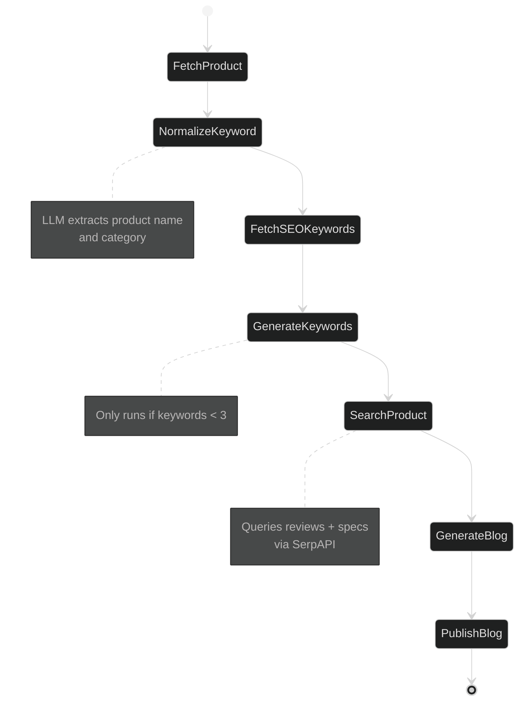
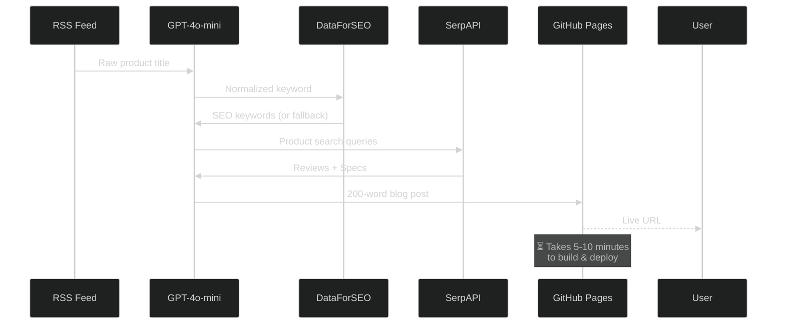

# SEO Blog Automation Tool

[](https://www.python.org/)
[](https://github.com/langchain-ai/langgraph)
[](https://openai.com/)
[](LICENSE)

> **Automated AI-powered SEO blog generation and publishing system using LangGraph workflow**

🔗 **Live Demo**: [https://jai-keshav-sharma.github.io/seo-blog-automation/](https://jai-keshav-sharma.github.io/seo-blog-automation/)

## 📋 Table of Contents

- [Overview](#overview)
- [Features](#features)
- [Architecture](#architecture)
- [Live Blog Examples](#live-blog-examples)
- [Installation](#installation)
- [Configuration](#configuration)
- [Usage](#usage)
- [Project Structure](#project-structure)
- [Workflow Details](#workflow-details)
- [Important Notes](#important-notes)
- [Evaluation Criteria](#evaluation-criteria)
- [Technologies Used](#technologies-used)
- [License](#license)

---

## 🎯 Overview

This project is an **end-to-end automated SEO blog creation tool** that:

1. **Scrapes** trending electronics products from RSS feeds
2. **Researches** SEO keywords using AI and DataForSEO API
3. **Gathers** product information via Google Search (SerpAPI)
4. **Generates** 200-word SEO-optimized blog posts using GPT-4o-mini
5. **Publishes** automatically to GitHub Pages

The entire pipeline is built using **LangGraph**, a framework for building stateful, multi-step AI workflows.

---

## ✨ Features

### Core Capabilities

- ✅ **Automated Product Discovery**: Monitors RSS feeds for trending electronics deals
- ✅ **AI-Powered Keyword Normalization**: LLM extracts core product names and categories
- ✅ **SEO Keyword Research**: Integrates DataForSEO API with LLM fallback
- ✅ **Smart Content Research**: Uses SerpAPI to gather product reviews and specifications
- ✅ **AI Blog Generation**: Creates engaging, SEO-optimized 200-word blog posts
- ✅ **Automated Publishing**: Deploys to GitHub Pages with Jekyll formatting
- ✅ **Modular Architecture**: Clean, maintainable code structure
- ✅ **Flexible LLM Support**: Works with OpenAI GPT-4o-mini and Groq models

### AI Integration

- **LangGraph Workflow**: Orchestrates 7-node sequential pipeline
- **GPT-4o-mini**: Powers keyword extraction, SEO generation, and blog writing
- **JSON Mode**: Ensures structured, parseable LLM outputs
- **Fallback Strategies**: Graceful degradation when APIs fail

---

## 🏗️ Architecture

### High-Level Workflow



### LangGraph State Machine



### Data Flow



---

## 🌐 Live Blog Examples

### Main Blog Page

🔗 [https://jai-keshav-sharma.github.io/seo-blog-automation/](https://jai-keshav-sharma.github.io/seo-blog-automation/)

### Published Blog Posts

1. **12V Lithium Battery Deal**🔗 [https://jai-keshav-sharma.github.io/seo-blog-automation/2025/12/23/discover-the-best-12v-lithium-battery-for-solar-humsienk-310/](https://jai-keshav-sharma.github.io/seo-blog-automation/2025/12/23/discover-the-best-12v-lithium-battery-for-solar-humsienk-310/)
2. **Best Buy Headphones Deals**
   🔗 [https://jai-keshav-sharma.github.io/seo-blog-automation/2025/12/23/unbeatable-best-buy-headphones-deals-save-big-now/](https://jai-keshav-sharma.github.io/seo-blog-automation/2025/12/23/unbeatable-best-buy-headphones-deals-save-big-now/)

---

## 🚀 Installation

### Prerequisites

- Python 3.11 or higher
- Git
- GitHub account
- API Keys (see [Configuration](#configuration))

### Step 1: Clone Repository

```bash
git clone https://github.com/Jai-Keshav-Sharma/seo-blog-automation.git
cd seo-blog-automation
```

### Step 2: Create Virtual Environment

```bash
# Using venv
python -m venv .venv
.venv\Scripts\activate  # Windows
source .venv/bin/activate  # Linux/Mac

# Or using uv (faster)
uv venv
uv pip install -r requirements.txt
```

### Step 3: Install Dependencies

```bash
pip install -r requirements.txt
```

**Dependencies:**

- `feedparser` - RSS feed parsing
- `requests` - HTTP requests
- `python-dotenv` - Environment variable management
- `langgraph` - Workflow orchestration
- `langchain-openai` - OpenAI LLM integration
- `langchain-groq` - Groq LLM integration (optional)
- `langchain-core` - Core LangChain utilities
- `google-search-results` - SerpAPI wrapper

---

## ⚙️ Configuration

### Step 1: Create `.env` File

Create a `.env` file in the project root:

```env
# Required: GitHub
GITHUB_TOKEN=ghp_your_github_personal_access_token
GITHUB_USERNAME=Jai-Keshav-Sharma
REPO_NAME=seo-blog-automation

# Required: OpenAI
OPENAI_API_KEY=sk-your_openai_api_key

# Required: SerpAPI
SERPAPI_KEY=your_serpapi_key

# Required: DataForSEO
DATAFORSEO_LOGIN=your_dataforseo_email
DATAFORSEO_PASSWORD=your_dataforseo_password

# Optional: LLM Configuration
LLM_PROVIDER=openai
LLM_MODEL=gpt-4o-mini

# Optional: Groq (alternative to OpenAI)
GROQ_API_KEY=your_groq_api_key
```

### Step 2: Obtain API Keys

#### 1. GitHub Personal Access Token

1. Go to [GitHub Settings → Developer Settings → Personal Access Tokens](https://github.com/settings/tokens)
2. Generate new token (classic)
3. Select scopes: `repo` (full control)
4. Copy token to `.env`

#### 2. OpenAI API Key

1. Visit [OpenAI Platform](https://platform.openai.com/api-keys)
2. Create new API key
3. Add to `.env`

#### 3. SerpAPI Key

1. Sign up at [SerpAPI](https://serpapi.com/)
2. Get free 100 searches/month
3. Copy API key to `.env`

#### 4. DataForSEO Credentials

1. Register at [DataForSEO](https://dataforseo.com/)
2. Get free 100 API calls/day
3. Add login/password to `.env`

### Step 3: Enable GitHub Pages

1. Go to your repository settings:`https://github.com/YOUR_USERNAME/seo-blog-automation/settings/pages`
2. Under **Build and deployment**:

   - Source: **Deploy from a branch**
   - Branch: **main**
   - Folder: **/ (root)**
3. Click **Save**
4. Run setup script:

   ```bash
   python setup_github_pages.py
   ```

---

## 🎮 Usage

### Run the Automation

```bash
python main.py
```

### Expected Output

```
============================================================
🚀 SEO Blog Automation - LangGraph Workflow
============================================================

[NODE 1] Fetching latest product...
Product: Humsienk 12V 310Ah LiFePO4 Lithium Battery...

[NODE 2] Normalizing keyword with LLM...
Normalized: humsienk lithium battery (lithium battery)

[NODE 3] Fetching SEO keywords from DataForSEO...
DataForSEO returned 4 keywords

[NODE 4] Skipping LLM keyword generation (enough keywords)

[NODE 5] Searching product info via SerpAPI...
Found 3 review results
Found 3 spec results
Gathered 847 chars of search data

[NODE 6] Generating blog with LLM...
Blog title: Discover the Best 12V Lithium Battery for Solar...
Blog length: 201 words

[NODE 7] Publishing to GitHub...
✓ File committed successfully

📄 Direct File: https://github.com/Jai-Keshav-Sharma/...
🌐 GitHub Pages: https://jai-keshav-sharma.github.io/...

============================================================
✅ WORKFLOW COMPLETE
============================================================
📝 Blog Title: Discover the Best 12V Lithium Battery...
🔑 SEO Keywords: ['12v lithium battery for solar', ...]
🔗 Live URL: https://jai-keshav-sharma.github.io/...
============================================================
```

---

## 📁 Project Structure

```
seo-blog-automation/
├── src/
│   ├── __init__.py
│   ├── config.py              # Configuration & environment variables
│   ├── models.py              # BlogState TypedDict schema
│   ├── prompts.py             # LLM prompts for all nodes
│   ├── llm.py                 # LLM provider factory (OpenAI/Groq)
│   ├── workflow.py            # LangGraph workflow definition
│   └── nodes/
│       ├── __init__.py
│       ├── scraper.py         # Node 1: Fetch product from RSS
│       ├── normalizer.py      # Node 2: LLM keyword normalization
│       ├── seo.py             # Node 3 & 4: SEO keyword research
│       ├── search.py          # Node 5: SerpAPI product search
│       ├── generator.py       # Node 6: LLM blog generation
│       └── publisher.py       # Node 7: GitHub Pages publishing
├── tests/
│   ├── test_apify.py          # Test Apify connection (deprecated)
│   ├── test_dataforseo.py     # Test DataForSEO API
│   ├── test_serpapi.py        # Test SerpAPI connection
│   └── setup_github_pages.py # GitHub Pages setup script
├── _posts/                    # Generated blog posts (Jekyll format)
├── main.py                    # Entry point
├── requirements.txt           # Python dependencies
├── .env                       # Environment variables (not in repo)
├── .gitignore
├── _config.yml                # Jekyll configuration
├── index.md                   # Blog homepage
└── README.md                  # This file
```

---

## 🔄 Workflow Details

### Node 1: Fetch Product (`scraper.py`)

**Input**: RSS feed URL**Output**: `product_title`, `product_description`

- Parses DealsNews electronics RSS feed
- Extracts latest trending product
- Strips HTML from description

### Node 2: Normalize Keyword (`normalizer.py`)

**Input**: `product_title`**Output**: `normalized_name`, `product_category`

- Uses GPT-4o-mini to extract core product name
- Identifies product category
- Removes pricing, shipping info, special characters
- Example: "Apple AirPods Pro $199" → `{name: "apple airpods pro", category: "wireless earbuds"}`

### Node 3: Fetch SEO Keywords (`seo.py`)

**Input**: `normalized_name`**Output**: `seo_keywords` (list)

- Calls DataForSEO Keyword Research API
- Retrieves top 4 SEO-optimized keywords
- Focuses on search volume and buyer intent

### Node 4: Generate Keywords (`seo.py`)

**Input**: `normalized_name`, `product_category`, `product_description`**Output**: `seo_keywords` (list)

- **Only runs if Node 3 returns < 3 keywords**
- Uses GPT-4o-mini to generate 4 SEO keywords
- Fallback mechanism ensures workflow never fails

### Node 5: Search Product (`search.py`)

**Input**: `normalized_name`**Output**: `search_results` (text)

- Performs 2 SerpAPI searches:
  1. `"{product} review"`
  2. `"{product} specifications"`
- Extracts top 3 snippets from each
- Combines into structured text for blog generation

### Node 6: Generate Blog (`generator.py`)

**Input**: All state data**Output**: `blog_title`, `blog_content`

- Uses GPT-4o-mini to write 200-word blog post
- **Requirements enforced by prompt**:
  - Title must include 1 SEO keyword
  - Body must naturally incorporate all keywords
  - Structure: Introduction → Features → Trending → Conclusion
  - Engaging, conversational tone

### Node 7: Publish Blog (`publisher.py`)

**Input**: `blog_title`, `blog_content`**Output**: `publish_url`

- Creates Jekyll-compatible markdown file
- Adds frontmatter (title, date)
- Slugifies title for URL
- Base64 encodes content
- Commits to GitHub via API
- Returns GitHub Pages URL

---

## ⚠️ Important Notes

### GitHub Pages Build Time

> **🕐 IMPORTANT**: Blog posts may take **5-10 minutes** to appear on GitHub Pages after publishing.

This is because:

1. GitHub Pages needs to rebuild the Jekyll site
2. Build queue depends on GitHub's server load
3. CDN cache needs to refresh

**What you'll see**:

- ✅ File appears immediately in GitHub repository
- ⏳ GitHub Pages URL shows 404 for ~5-10 minutes
- ✅ Post becomes live after Jekyll build completes

**How to verify**:

- Check [GitHub Actions](https://github.com/Jai-Keshav-Sharma/seo-blog-automation/actions) for build status
- Look for "pages build and deployment" workflow

### API Rate Limits

- **OpenAI GPT-4o-mini**: Pay-per-use (very cheap, ~$0.01 per blog)
- **SerpAPI**: 100 searches/month (free tier)
- **DataForSEO**: 100 API calls/day (free tier)
- **GitHub API**: 5,000 requests/hour (authenticated)

### Error Handling

The workflow includes **fallback strategies**:

- If DataForSEO fails → LLM generates keywords
- If SerpAPI fails → Uses product description
- If LLM returns invalid JSON → Template keywords/content

---

## 📊 Evaluation Criteria

### 1. Feasibility of Implementation ✅

**Demonstrated through**:

- ✅ Fully functional end-to-end automation
- ✅ Live blog posts published to GitHub Pages
- ✅ Integration of multiple AI services (OpenAI, SerpAPI, DataForSEO)
- ✅ Robust error handling and fallback mechanisms
- ✅ Scalable architecture using LangGraph

**Proof**: [Live Blog Site](https://jai-keshav-sharma.github.io/seo-blog-automation/)

### 2. Clear, Simple, Practical Use of AI Tools ✅

**AI Integration**:

- **LangGraph**: Orchestrates 7-node workflow with state management
- **GPT-4o-mini**:
  - Keyword normalization (removes noise from product titles)
  - SEO keyword generation (backup when API fails)
  - Blog content generation (200-word SEO-optimized posts)
- **DataForSEO API**: Professional keyword research
- **SerpAPI**: Automated product information gathering

**Simplicity**:

- Modular code structure (each node = single responsibility)
- Clear separation of concerns (prompts, models, nodes)
- Environment-based configuration
- Single command execution: `python main.py`

### 3. Quality of Work & Ease of Understanding ✅

**Code Quality**:

- ✅ Type hints throughout (`BlogState: TypedDict`)
- ✅ Comprehensive docstrings
- ✅ Clean separation: config, models, prompts, nodes
- ✅ Error handling with debugging output
- ✅ Consistent naming conventions

**Documentation**:

- ✅ Detailed README with architecture diagrams
- ✅ Step-by-step installation guide
- ✅ API key setup instructions
- ✅ Mermaid diagrams for visual understanding
- ✅ Code comments explaining complex logic

**Ease of Use**:

- ✅ One-file `.env` configuration
- ✅ Automated setup scripts (`setup_github_pages.py`)
- ✅ Test scripts for API validation
- ✅ Clear console output with progress indicators

---

## 🛠️ Technologies Used

### Core Framework

- **LangGraph 0.2.45** - Stateful workflow orchestration
- **LangChain Core 0.3.17** - LLM abstractions

### AI & LLMs

- **OpenAI GPT-4o-mini** - Keyword extraction, SEO generation, blog writing
- **Langchain-OpenAI 0.2.9** - OpenAI integration
- **Langchain-Groq 0.2.1** - Alternative LLM support

### APIs & Services

- **DataForSEO** - Keyword research (replaces Apify)
- **SerpAPI** - Google search results
- **GitHub API** - Automated publishing

### Data Processing

- **feedparser 6.0.11** - RSS feed parsing
- **requests 2.31.0** - HTTP requests
- **python-dotenv 1.0.1** - Environment management

### Publishing

- **GitHub Pages** - Static site hosting
- **Jekyll** - Static site generator (via GitHub Pages)

---

## 🎓 Learning Outcomes

This project demonstrates:

1. **LangGraph Workflow Design** - Building multi-step AI pipelines
2. **Prompt Engineering** - Crafting effective LLM prompts with JSON mode
3. **API Integration** - Combining multiple services (OpenAI, SerpAPI, DataForSEO, GitHub)
4. **Error Handling** - Graceful degradation and fallback strategies
5. **Modular Architecture** - Clean code organization for maintainability
6. **Automation** - End-to-end pipeline from data source to published content

---

## 📝 License

MIT License - See [LICENSE](LICENSE) file for details

---

## 🙏 Acknowledgments

- **LangChain Team** - For the excellent LangGraph framework
- **OpenAI** - For GPT-4o-mini API
- **DataForSEO** - For keyword research API
- **SerpAPI** - For Google search API
- **GitHub** - For Pages hosting

---

## 📧 Contact

**Developer**: Jai Keshav Sharma
**GitHub**: [@Jai-Keshav-Sharma](https://github.com/Jai-Keshav-Sharma)
**Project Link**: [https://github.com/Jai-Keshav-Sharma/seo-blog-automation](https://github.com/Jai-Keshav-Sharma/seo-blog-automation)

---

<div align="center">
