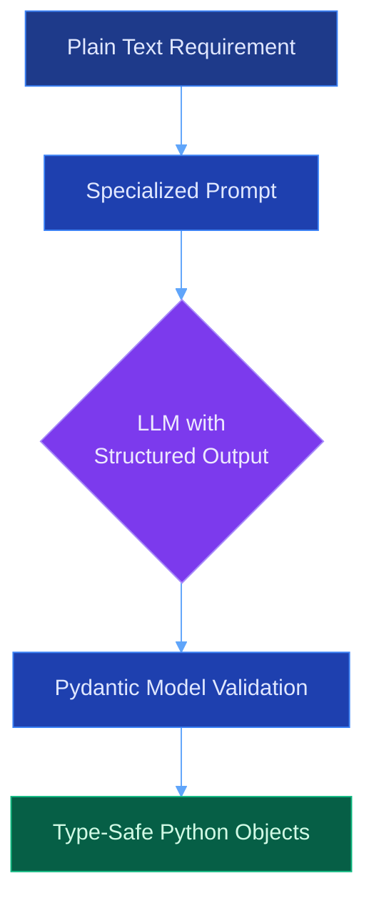
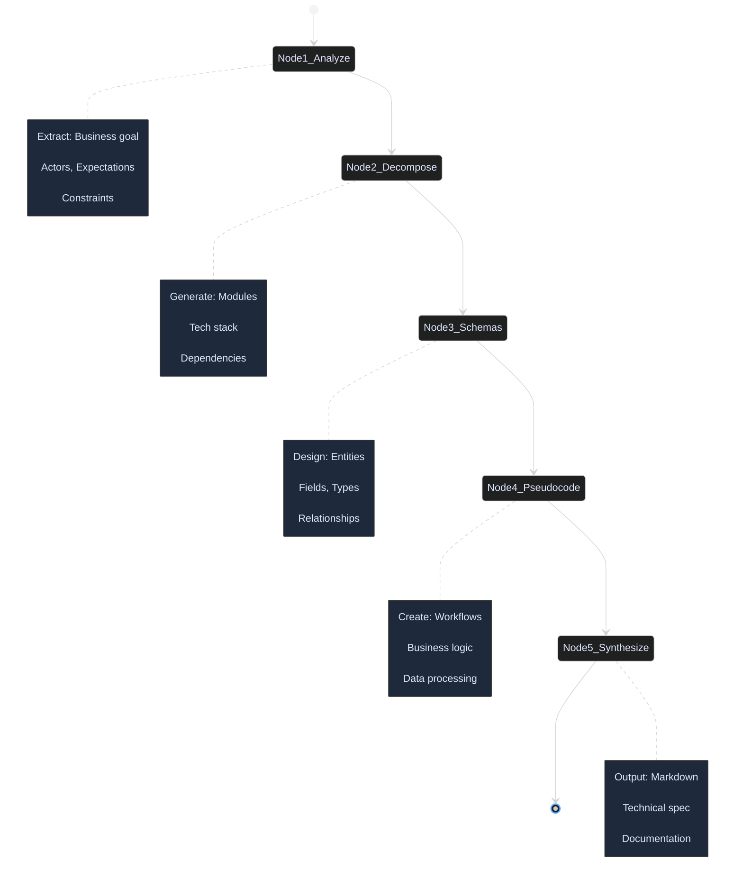
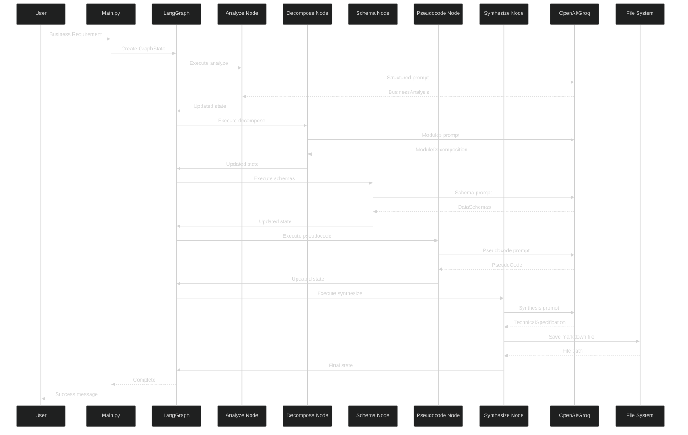

# AI-Based Business Requirement to Technical Specification Pipeline

## 📋 Project Overview

This project implements an **AI-powered automation pipeline** that converts high-level business requirements (written in plain, non-technical language) into comprehensive, developer-friendly technical specifications.

The system analyzes business needs and automatically generates:

- System architecture and module breakdown
- Data schemas and database design
- Pseudo-code for core workflows
- Complete technical documentation in Markdown format

---

## 🎯 Objective

Design and demonstrate an AI-based automation tool that bridges the gap between business stakeholders and technical teams by:

1. **Understanding** business requirements in natural language
2. **Analyzing** core goals, users, and constraints
3. **Designing** system architecture with modules and data models
4. **Generating** implementation logic and pseudo-code
5. **Documenting** everything in a structured, developer-ready format

---

## 🏗️ System Architecture

The pipeline uses a **sequential workflow** where each stage builds upon the previous one:


---

## 🤖 AI Integration

### How AI is Used

The system leverages **Large Language Models (LLMs)** with **structured outputs** to ensure consistent, high-quality results:



**Key AI Features:**

- **OpenAI GPT-4o-mini** and **Groq Llama-3.3-70B** for natural language understanding
- **Structured outputs** using Pydantic models for data validation
- **Specialized prompts** for each conversion stage
- **Temperature control** for balancing creativity and consistency

---

## 🔄 Workflow Pipeline

The system implements a **5-stage linear pipeline** using LangGraph:



### Stage Details

| Stage                      | Input                     | AI Task                            | Output                              |
| -------------------------- | ------------------------- | ---------------------------------- | ----------------------------------- |
| **1. Analysis**      | Business requirement text | Extract goals, actors, constraints | Structured business analysis        |
| **2. Decomposition** | Business analysis         | Design system architecture         | List of modules with tech stack     |
| **3. Schema Design** | Modules + analysis        | Create data models                 | Database schemas with relationships |
| **4. Pseudo-code**   | Schemas + modules         | Generate implementation logic      | Step-by-step algorithms             |
| **5. Synthesis**     | All previous outputs      | Format comprehensive documentation | Markdown technical specification    |

---

## 📁 Project Structure

```
business/
├── main.py                      # Entry point - runs the full pipeline
├── .env                         # API keys (not in git)
├── .env.example                 # Template for environment variables
├── requirements.txt             # Python dependencies
├── README.md                    # This file
│
├── src/                         # Source code modules
│   ├── __init__.py
│   ├── config.py                # LLM configuration and API setup
│   ├── prompts.py               # AI prompts for each stage
│   ├── models.py                # Pydantic data models
│   ├── graph.py                 # LangGraph workflow definition
│   ├── utils.py                 # Helper functions (file saving, etc.)
│   │
│   └── nodes/                   # Pipeline stage implementations
│       ├── __init__.py
│       ├── analyze.py           # Stage 1: Requirement analysis
│       ├── decompose.py         # Stage 2: Module decomposition
│       ├── schemas.py           # Stage 3: Schema design
│       ├── pseudocode.py        # Stage 4: Pseudo-code generation
│       └── synthesize.py        # Stage 5: Report synthesis
│
├── notebooks/                   # Jupyter notebooks for experimentation
│   └── workflow.ipynb           # Proof-of-concept demo
│
└── Outputs/                     # Generated technical specifications
    └── <project_name>/
        └── specification.md
```

**Design Principles:**

- ✅ **Modular**: Each node is independent and testable
- ✅ **Type-safe**: Pydantic models ensure data consistency
- ✅ **Configurable**: Easy to switch LLM providers
- ✅ **Production-ready**: Clean separation of concerns

---

## 🚀 Installation & Setup

### Prerequisites

- Python 3.10 or higher
- OpenAI API key and/or Groq API key

### Installation Steps

1. **Clone or extract the project**

   ```bash
   cd business
   ```
2. **Install dependencies**

   ```bash
   pip install -r requirements.txt
   ```
3. **Configure API keys**

   Copy the example environment file:

   ```bash
   cp .env.example .env
   ```

   Edit `.env` and add your API keys:

   ```
   OPENAI_API_KEY=your_openai_key_here
   GROQ_API_KEY=your_groq_key_here
   ```

---

## 💻 Usage

### Command Line

**Run with default example:**

```bash
python main.py
```

**Run with custom requirement:**

```bash
python main.py "Build a real-time chat application for team collaboration"
```

**Example output:**

```
================================================================================
🤖 AI-Based Requirement to Technical Specification Pipeline
================================================================================

📋 Business Requirement:
   Build a system that recommends products to users based on browsing history.

🔄 Starting conversion pipeline...
--------------------------------------------------------------------------------

📊 Analyzing business requirements...
✅ Analysis complete. Project: 'Product Recommendation System'

🏗️  Decomposing system into modules...
✅ Identified 6 modules

🗄️  Designing data schemas...
✅ Designed 4 data schemas

💻 Generating pseudo-code...
✅ Generated 3 pseudo-code sections

📝 Synthesizing technical specification...
✅ Report saved to: Outputs\product_recommendation_system\specification.md

--------------------------------------------------------------------------------
✨ Pipeline completed successfully!
📁 Technical specification generated for: 'Product Recommendation System'
================================================================================
```

### Jupyter Notebook

For experimentation and demonstration:

```bash
jupyter notebook notebooks/workflow.ipynb
```

The notebook provides an interactive walkthrough of the pipeline with:

- Step-by-step execution
- Visual workflow graph
- Rich markdown rendering of the final report

---

## 📊 Example Output

The system generates a comprehensive technical specification document with:

### Sections Included:

1. **Executive Summary** - Overview of the requirement and solution
2. **Business Requirement Analysis** - Goals, actors, constraints
3. **System Architecture** - Modules, components, dependencies
4. **Data Architecture** - Schemas, relationships, indexing
5. **Implementation Logic** - Pseudo-code for workflows
6. **Technical Recommendations** - Best practices and considerations

### Sample Output Structure:

```markdown
# Technical Specification: Product Recommendation System

## 1. Executive Summary
Brief overview of creating a personalized product recommendation 
engine based on user browsing behavior...

## 2. Business Requirement Analysis
### Core Business Goal
Increase user engagement and sales by providing personalized 
product recommendations...

### Key Actors
- End Users (shoppers)
- System Administrators
- Data Analysts
...

## 3. System Architecture
### Modules
1. **Recommendation Engine**
   - Responsibility: Generate personalized product suggestions
   - Tech Stack: Python, scikit-learn, Redis
   - Dependencies: User Profile Service, Product Catalog
...
```

---

## ⚙️ Configuration

### Switching LLM Providers

Edit `src/config.py`:

```python
class Config:
    PRIMARY_PROVIDER = "openai"  # Change to "groq" for Groq
  
    OPENAI_MODEL = "gpt-4o-mini"
    GROQ_MODEL = "llama-3.3-70b-versatile"
```

### Adjusting Temperature

Lower temperature (0.1-0.3) = More consistent/deterministic
Higher temperature (0.6-0.9) = More creative/varied

```python
llm = Config.get_llm(temperature=0.3)  # More focused
llm = Config.get_llm(temperature=0.7)  # More creative
```

---

## 🛠️ Technical Implementation

### Data Flow



### Key Technologies

- **LangGraph**: Workflow orchestration and state management
- **LangChain**: LLM abstraction and integration
- **Pydantic**: Data validation and structured outputs
- **OpenAI/Groq**: LLM providers for natural language processing

---

## 📚 Dependencies

```
langgraph>=0.2.0          # Workflow orchestration
langchain>=0.3.0          # LLM framework
langchain-openai>=0.2.0   # OpenAI integration
langchain-groq>=0.2.0     # Groq integration
openai>=1.50.0            # OpenAI API client
pydantic>=2.0.0           # Data validation
python-dotenv>=1.0.0      # Environment management
```

---

## ✅ Evaluation Criteria Alignment

### 1. Feasibility of Implementation

- ✅ Uses well-established frameworks (LangGraph, LangChain)
- ✅ Simple linear workflow - easy to understand and debug
- ✅ Modular architecture allows incremental development
- ✅ Successfully tested with multiple business requirements

### 2. Clear, Simple, and Practical Use of AI

- ✅ AI used for specific, well-defined tasks at each stage
- ✅ Structured outputs ensure reliability and consistency
- ✅ Simple prompt engineering - no complex chains
- ✅ Practical application: saves hours of manual documentation work

### 3. Quality and Ease of Understanding

- ✅ Clean, documented code with type hints
- ✅ Modular structure - each file has a single responsibility
- ✅ Comprehensive README with diagrams
- ✅ Jupyter notebook for interactive demonstration
- ✅ Clear naming conventions and comments

---

## 🎓 Learning Outcomes

This project demonstrates:

1. **AI Automation**: Practical application of LLMs for business process automation
2. **Workflow Design**: Sequential pipeline architecture using LangGraph
3. **Structured AI Outputs**: Using Pydantic for reliable, type-safe AI responses
4. **Prompt Engineering**: Crafting specialized prompts for specific tasks
5. **Software Architecture**: Modular, maintainable, production-ready code

---

## 🔮 Future Enhancements

Potential improvements for production use:

- [ ] Add validation layer to check output quality
- [ ] Implement iterative refinement with feedback loops
- [ ] Add support for more output formats (PDF, HTML, JSON)
- [ ] Create web interface for easier access
- [ ] Add caching to reduce API costs
- [ ] Implement parallel processing for faster execution
- [ ] Add unit tests and integration tests

---

## 📄 License

This project is created for educational purposes as part of an AI automation assignment.
