# AI-Based Trending News → Video Generation Pipeline

## 📌 Project Overview (Read This First)

This project implements an **AI-based end-to-end pipeline** that:
1. Scrapes **trending news content**
2. Converts it into a **short narration script using LLMs**
3. Generates **AI-based visual content**
4. Composes a **30–60 second video** with text overlays and images

The primary objective was **not cinematic perfection**, but to demonstrate:
- Practical AI system design
- Reasoned engineering trade-offs
- A working, explainable pipeline under real-world constraints

---

## ⚠️ Constraints & Design Realities (Honest Disclosure)

This project was developed under **strict and unavoidable constraints**, which strongly influenced the final architecture:

### Computational Constraints
- No access to high-memory GPUs
- Open-source **text-to-video diffusion models consistently ran out of memory**
- Video diffusion pipelines were not feasible in Colab or local environments

### Cost Constraints
- Paid video generation APIs cost approximately **$1 per video**, which was not affordable for iterative experimentation
- The project required a **repeatable, low-cost workflow**

### Environment Constraints
- Entire workflow had to run inside **Google Colab**
- No reliance on system-level binaries (e.g., ImageMagick)
- GPU availability was limited and inconsistent

> I regret that these constraints prevented the use of state-of-the-art video diffusion models.  
> However, rather than forcing unstable or partially working solutions, the approach was deliberately redesigned to remain **robust, reproducible, and defensible**.

This was an **engineering decision**, not a compromise in intent.

---

## 📌 Notebook Link: https://colab.research.google.com/drive/1ELJjy4YAGdauBMeLTxYHjAMb1xRvWQzs?usp=sharing

## ✅ Final Outcome (What This Project Delivers)

- Fully automated AI pipeline
- Real-time trending news ingestion
- LLM-driven script and scene planning
- Stable Diffusion XL–based image generation
- Programmatic video composition with readable overlays
- Runs end-to-end in Google Colab

---

## 🎬 Results

> **Generated Videos:**  

https://github.com/user-attachments/assets/672c01d9-afa3-4e22-b757-5d1804a19bcf

https://github.com/user-attachments/assets/e79f7392-f4e6-4019-a34a-e2e8e243eeb4

Each video:
- Is 30–60 seconds long
- Contains AI-generated images
- Includes structured text overlays
- Reflects the original news narrative

---

## 🧠 High-Level Workflow (Implemented)

The final system follows a **sequential LangGraph-based workflow**, chosen for clarity and reliability.

### Mermaid Diagram — Implemented Workflow

## 🧠 How I would have approached it IF I had enough compute power!

```mermaid
flowchart TB
 subgraph SG["Story Generation (Iterative)"]
        E["Story Generation Phase"]
        D["Extract Character / Product Details"]
        F["Story Director Agent"]
        G["Generate Story Draft"]
        H["Story Critic Agent"]
        I["Score & Feedback"]
        J{"Score ≥ 85?"}
        K["Final Story"]
        L["Story Director Agent Revision"]
  end
 subgraph SC["Scene Generation (Per Scene)"]
        N["Scene Writer Agent"]
        M["Scene Generation Phase"]
        O["Writes Scene"]
        P["Scene Critic Agent"]
        Q["Score & Feedback"]
        R{"Score ≥ 85?"}
        S{"More Scenes?"}
        T["Scene Writer Agent Revision"]
        U["Scene Cohesor Agent"]
  end
 subgraph VE["Scene Enhancement for Video Parameter Generation"]
        Y["Scene Enhancer Agent"]
        X["Scene Enhancement Phase"]
        Z["Optimize for Veo 3.1"]
        AA["Scene Aligner Agent"]
        AB["Visual Consistency"]
        AC["Appearance Sanitizer Agent"]
        AD["Remove Redundant Descriptions"]
        AE["Enhanced Video Parameters"]
  end
    A["User Submits Request"] --> B["Upload Reference Images"]
    B --> C["Vision Analysis Agent"]
    C --> D
    D --> E
    E --> F
    F --> G
    G --> H
    H --> I
    I --> J
    J -- Yes or Max Iterations --> K
    J -- No & Iterations < 3 --> L
    L --> H
    K --> M
    M --> N
    N --> O
    O --> P
    P --> Q
    Q --> R
    R -- Yes or Max Iterations --> S
    R -- No & Iterations < 3 --> T
    T --> P
    S -- Yes --> N
    S -- No --> U
    U --> V["Check Cohesion"]
    V --> W{"Cohesion ≥ 85?"}
    W -- No & Iterations < 2 --> U
    W -- Yes --> X
    X --> Y
    Y --> Z
    Z --> AA
    AA --> AB
    AB --> AC
    AC --> AD
    AD --> AE
    AE --> AF["Video Generation - Veo 3.1 API"]
    AF --> AG["Generate Scene Videos"]
    AG --> AH["Video Stitcher"]
    AH --> AI["Apply Transitions & Effects"]
    AI --> AJ["Final Video"]
    AJ --> AK["Complete"]
```

